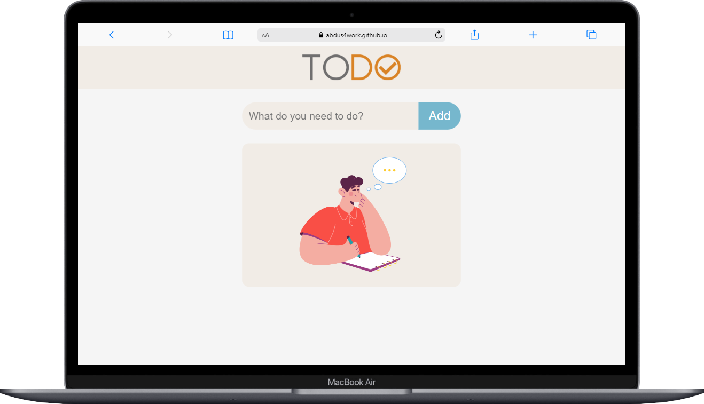
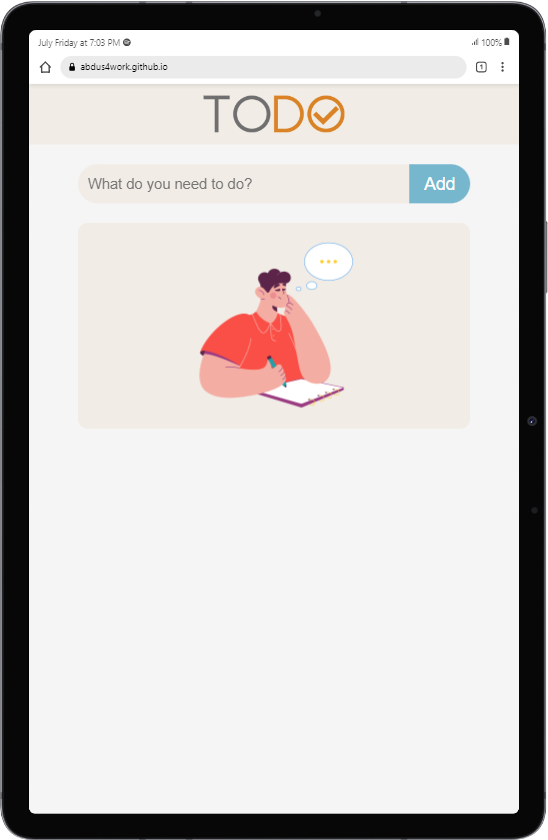
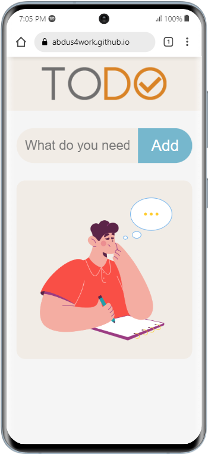
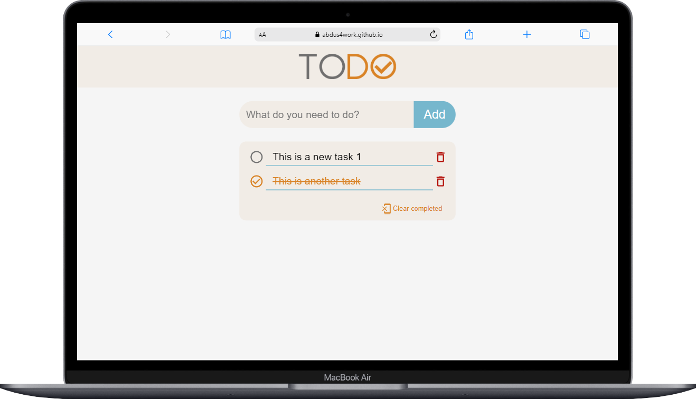
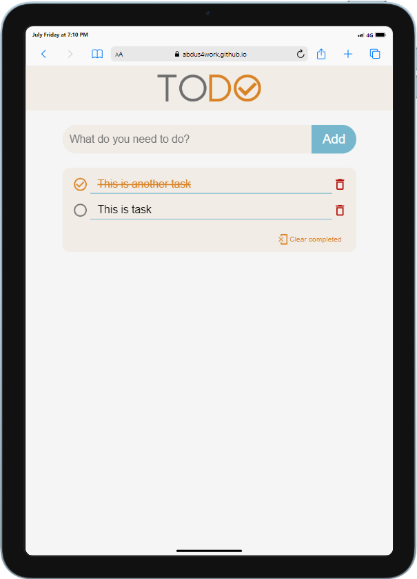

# ToDo App

This is a project for creating a ToDo list where users can add, delete, and mark tasks as completed.

## Features

- Add new tasks to the list
- Delete tasks from the list
- Mark tasks as completed

## Installation

1. Clone the repository: `git clone https://github.com/your-username/ToDo-App.git`
2. Navigate to the project directory: `cd ToDo-App`

## Usage

1. Start the Live server
2. Open your browser and go to `http://127.0.0.1:5500/index.html`
3. Start managing your ToDo list!

## Technologies Used

- JavaScript
- HTML
- CSS

## Screenshots

--- 

---

---

---

## Contributing

Contributions are welcome! If you have any suggestions or improvements, please create a pull request.

## License

This project is licensed under the MIT License. See the [LICENSE](LICENSE) file for more details.
